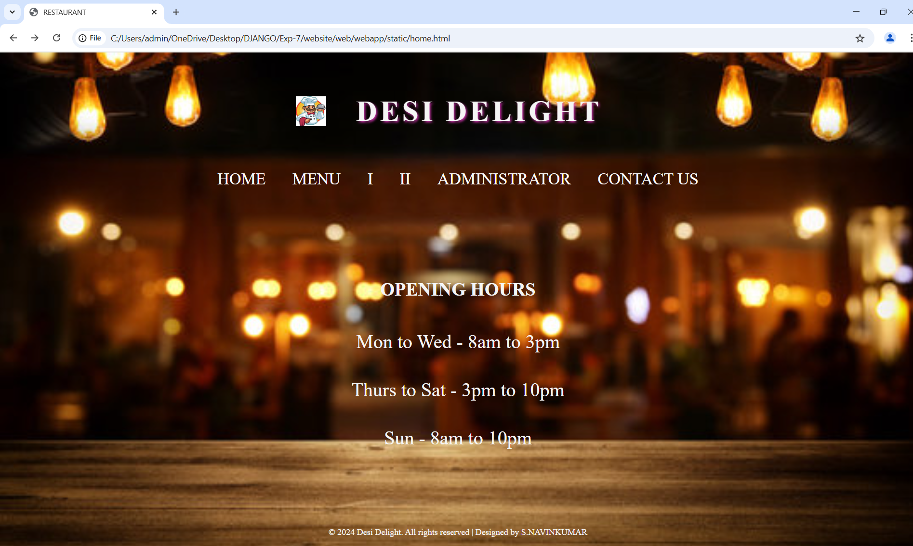
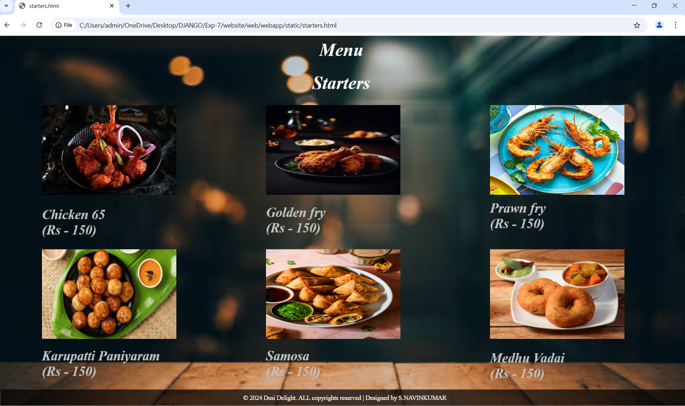
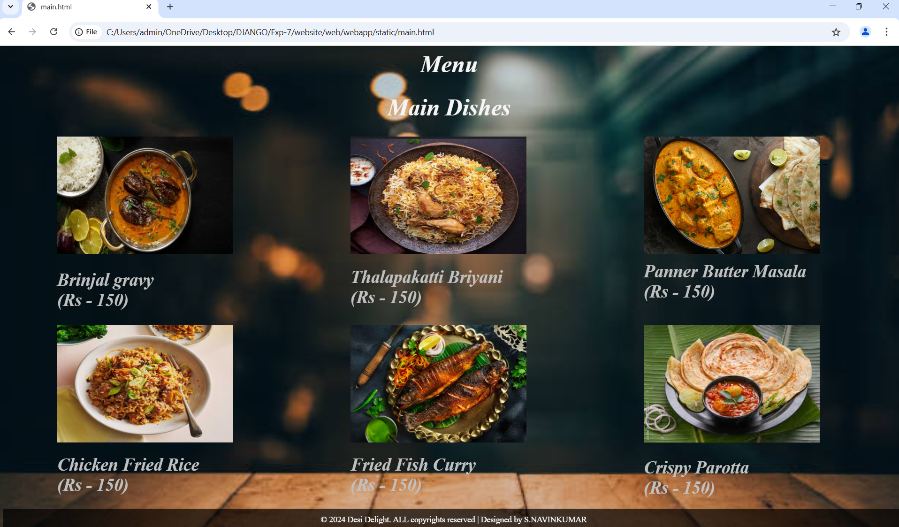
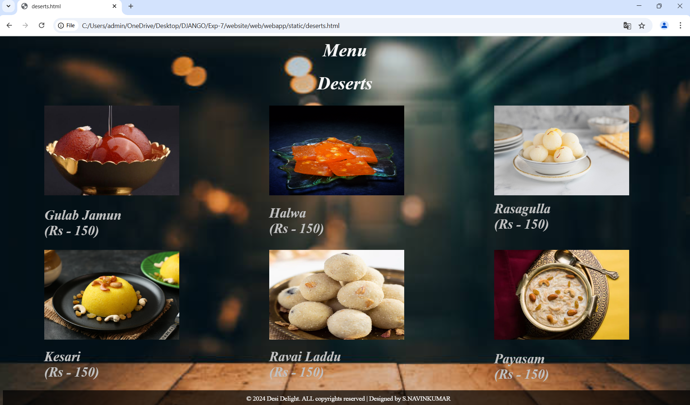
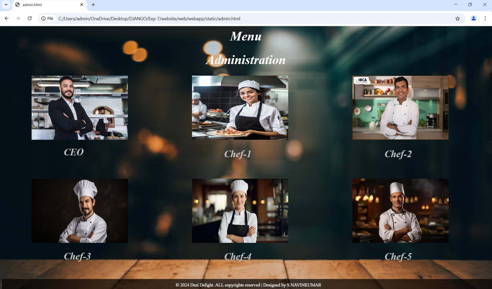
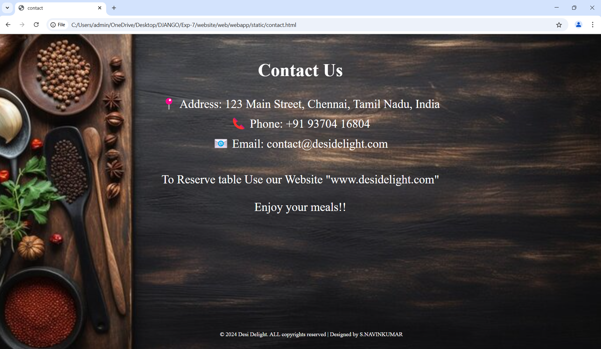

# Ex.07 Restaurant Website
# Date:27-04-2025
# AIM:
To develop a static Restaurant website to display the food items and services provided by them.

# DESIGN STEPS:
## Step 1:
Requirement collection.

## Step 2:
Creating the layout using HTML and CSS.

## Step 3:
Updating the sample content.

## Step 4:
Choose the appropriate style and color scheme.

## Step 5:
Validate the layout in various browsers.

## Step 6:
Validate the HTML code.

## Step 7:
Publish the website in the given URL.

# PROGRAM:
```
home.html:
<!DOCTYPE html>
<html lang="en">
<head>
    <meta charset="UTF-8">
    <meta name="viewport" content="width=device-width, initial-scale=1.0">
    <title>RESTAURANT</title>
    <style>
        * {
            margin: 0;
            padding: 0;
            box-sizing: border-box;
            font-family: italic, sans-serif;
        }

        body {
            width:auto;
            height:auto;
            color:whitesmoke;
        }

        body::before {
            content: '';
            position: absolute;
            top: 0;
            left: 0;
            width:100%;
            height: 100%;
            background:url("bg-1.jpg");
            background-size: cover;
            background-repeat: no-repeat;
            background-position: center;
            z-index: 1;
        }

        .container {
            position: relative;
            z-index: 2;
            padding: 20px;
            
        }

        .header {
            display: flex;
            align-items: center;
            justify-content: center;
            padding: 20px 0;
            
        }

        .header img {
            max-width: 150px; /* Adjust the logo size */
            margin-right: 20px; /* Space between logo and restaurant name */
        }

        .header h1 {
            
            font-size: 3em;
            text-transform: uppercase;
            letter-spacing: 5px;
            color:color-mix(in srgb, color percentage, color percentage);
            text-shadow: 2px 2px 4px rgb(205, 50, 174);
            bottom: 100px;
            margin: 30px;
            font-family:'Times New Roman', Times, serif;
        }

        .nav {
            text-align: center;
            margin: 20px 0;
            bottom:200px;
        }

        .nav a {
            color: white;
            text-decoration: none;
            margin: 0 20px;
            font-size: 1.7em;
            bottom:300px;
            text-transform: uppercase;
            font-family: 'Times New Roman', Times, serif;
        }

        .nav a:hover {
            text-decoration: underline;
            font-family: 'Times New Roman', Times, serif;
        }

        .content {
            display: flex;
            justify-content: space-around;
            flex-wrap: wrap;
            padding: 40px 20px;
        }
        
        .section{
            max-width:max-content;
            margin: 30px;
            bottom:20px; 
        }

        .section h2{
            font-size: 1.9em;
            text-align: center;
            margin-bottom: 30px;
            text-transform: uppercase;
        }

        .section p{
            line-height:5em;
            font-size:1.5em;
        }
        

        .sec{
            max-width:1300px;
            margin: 150px;
            bottom: 1000px; 
            text-align: center;
        }

        .sec h2{
            font-size: 1.9em;
            text-align: center;
            margin-bottom: 30px;
            text-transform: uppercase;
            font-family: 'Times New Roman', Times, serif;
        }

        .sec p{
            line-height: 2.5em;
            font-size: 2em;
            font-family: 'Times New Roman', Times, serif;
        }

        .footer {
            text-align: center;
            padding: 20px;
            position: absolute;
            bottom: 0;
            width: 100%;
            z-index: 2;
        }

        .footer p {
            font-size: 0.9em;
            font-family: 'Times New Roman', Times, serif;
        }
    </style>
</head>
<body>
    <div class="container">
        <div class="header">
            
            <h1>Desi Delight</h1>
        </div>
        <div class="nav">
            <a href="home.html">Home</a>
            <a href="starters.html">Menu</a>
            <a href="main.html">i</a>
            <a href="deserts.html">ii</a>
            <a href="admin.html">Administrator</a>
            <a href="contact.html">Contact us</a>
        </div>
        
            <div class="sec">
              <h2>OPENING HOURS</h2>
              <p>Mon to Wed - 8am to 3pm<br>Thurs to Sat - 3pm to 10pm<br>Sun - 8am to 10pm</b></p>
            </div>
        </div>
    </div>
    <div class="footer">
        <p>© 2024 Desi Delight. All rights reserved | Designed by S.NAVINKUMAR</p>
    </div>
</body>
</html>

menu.html:
starters:
<html>
    <head>
        <style>
            body {
                background-image: url("bg-12.jpg");
                background-size: cover;
                background-repeat: no-repeat;
                background-position: center;
                background-attachment: fixed;
            }
            .box{

                font-size:20px;
                text-align: center;
                font-style: italic;
                color: whitesmoke;
            }
            .imn1{
                height: 200px;
                width: 300px;
                left: 100px;
                position: fixed;
            }
             h2{
                font-style: italic;
                font-size: 30px;
                left: 100px;
                position: fixed;
                bottom:350px;
                color: silver;
            }
            .imn2{
                height: 200px;
                width: 300px;
                left: 600px;
                position: fixed;
            }
             h3{
                font-style: italic;
                font-size: 30px;
                left: 600px;
                position: fixed;
                bottom:350px;
                color: silver;
            }
            .imn3{
                height: 200px;
                width: 300px;
                left: 1100px;
                position: fixed;
            }
             h4{
                font-style: italic;
                font-size: 30px;
                left: 1100px;
                position: fixed;
                bottom:350px;
                color: silver;
            }
            .imn4{
                height: 200px;
                width: 300px;
                left: 100px;
                position: fixed;
                bottom: 150px;
            }
             h5{
                font-style: italic;
                font-size: 30px;
                left: 100px;
                position: fixed;
                bottom:10px;
                color: silver;
             }
             .imn5{
                height: 200px;
                width: 300px;
                left: 600px;
                position: fixed;
                bottom: 150px;
            }
             h6{
                font-style: italic;
                font-size: 30px;
                left: 600px;
                position: fixed;
                bottom:-10px;
                color: silver;
             }
             .imn6{
                height: 200px;
                width: 300px;
                left: 1100px;
                position: fixed;
                bottom: 150px;
            }
             h7{
                font-style: italic;
                font-size: 30px;
                left: 1100px;
                position: fixed;
                bottom:55px;
                color: silver;
            }
            .footer {
                position: fixed;
                bottom: 0;
                width: 100%;
                text-align: center;
                background-color: rgba(0, 0, 0, 0.7);
                color: white;
                padding: 10px 0;
                font-size: 14px;
                z-index: 5;
            }

        </style>
    </head>
    <body>
        <div class="box">
            <h1>Menu</h1>
        </div>
        <div class="box">
            <h1>Starters</h1>
        </div>
        <div>
            
            <h2>Chicken 65<br>(Rs - 150)</h2>
            
            
            <h3>Golden fry<br>(Rs - 150)</h3>
        
            
            <h4>Prawn fry<br>(Rs - 150)</h4>

            
            <h5>Karupatti Paniyaram<br>(Rs - 150)</h5>

            
            <h6>Samosa<br>(Rs - 150)</h6>

            
            <h7><b>Medhu Vadai<br>(Rs - 150)</b></h7>
        </div> 
        <div class="footer">
            © 2024 Desi Delight. ALL copyrights reserved | Designed by S.NAVINKUMAR
        </div>
    </body>
</html>

main dishes:
<html>
    <head>
        <style>
            body {
                background-image: url("bg-12.jpg");
                background-size: cover;
                background-repeat: no-repeat;
                background-position: center;
                background-attachment: fixed;
            }
            .box{

                font-size:20px;
                text-align: center;
                font-style: italic;
                color:whitesmoke;

            }
            .imn1{
                height: 200px;
                width: 300px;
                left: 100px;
                position: fixed;
            }
             h2{
                font-style: italic;
                font-size: 30px;
                left: 100px;
                position: fixed;
                bottom:350px;
                color: silver;
            }
            .imn2{
                height: 200px;
                width: 300px;
                left: 600px;
                position: fixed;
            }
             h3{
                font-style: italic;
                font-size: 30px;
                left: 600px;
                position: fixed;
                bottom:350px;
                color: silver;
            }
            .imn3{
                height: 200px;
                width: 300px;
                left: 1100px;
                position: fixed;
            }
             h4{
                font-style: italic;
                font-size: 30px;
                left: 1100px;
                position: fixed;
                bottom:350px;
                color: silver;
            }
            .imn4{
                height: 200px;
                width: 300px;
                left: 100px;
                position: fixed;
                bottom: 150px;
            }
             h5{
                font-style: italic;
                font-size: 30px;
                left: 100px;
                position: fixed;
                bottom:10px;
                color:  silver;
             }
             .imn5{
                height: 200px;
                width: 300px;
                left: 600px;
                position: fixed;
                bottom: 150px;
            }
             h6{
                font-style: italic;
                font-size: 30px;
                left: 600px;
                position: fixed;
                bottom:-10px;
                color: silver;
             }
             .imn6{
                height: 200px;
                width: 300px;
                left: 1100px;
                position: fixed;
                bottom: 150px;
            }
             h7{
                font-style: italic;
                font-size: 30px;
                left: 1100px;
                position: fixed;
                bottom:55px;
                color: silver;
            }

            .footer {
                position: fixed;
                bottom: 0;
                width: 100%;
                text-align: center;
                background-color: rgba(0, 0, 0, 0.7);
                color: white;
                padding: 10px 0;
                font-size: 14px;
                z-index: 5;
            }
            
            
        </style>
    </head>
    <body>
        <div class="box">
            <h1>Menu</h1>
        </div>
        <div class="box">
            <h1>Main Dishes</h1>
        </div>
        <div>
            
            <h2>Brinjal gravy <br>(Rs - 150)</h2>
            
            
            <h3>Thalapakatti Briyani<br>(Rs - 150)</h3>
        
            
            <h4>Panner Butter Masala<br>(Rs - 150)</h4>

            
            <h5>Chicken Fried Rice<br>(Rs - 150)</h5>

            
            <h6>Fried Fish Curry<br>(Rs - 150)</h6>

            
            <h7><b>Crispy Parotta<br>(Rs - 150)</b></h7>
        </div> 
        <div class="footer">
            © 2024 Desi Delight. ALL copyrights reserved | Designed by S.NAVINKUMAR
        </div>
    </body>
</html>

deserts:
<html>
    <head>
        <style>
            body {
                background-image: url("bg-12.jpg");
                background-size: cover;
                background-repeat: no-repeat;
                background-position: center;
                background-attachment: fixed;
            }
            .box{

                font-size:20px;
                text-align: center;
                font-style: italic;
                color: whitesmoke;
            }
            .imn1{
                height: 200px;
                width: 300px;
                left: 100px;
                position: fixed;
            }
             h2{
                font-style: italic;
                font-size: 30px;
                left: 100px;
                position: fixed;
                bottom:350px;
                color: silver;

            }
            .imn2{
                height: 200px;
                width: 300px;
                left: 600px;
                position: fixed;
            }
             h3{
                font-style: italic;
                font-size: 30px;
                left: 600px;
                position: fixed;
                bottom:350px;
                color: silver;

            }
            .imn3{
                height: 200px;
                width: 300px;
                left: 1100px;
                position: fixed;
            }
             h4{
                font-style: italic;
                font-size: 30px;
                left: 1100px;
                position: fixed;
                bottom:350px;
                color: silver;

            }
            .imn4{
                height: 200px;
                width: 300px;
                left: 100px;
                position: fixed;
                bottom: 150px;
            }
             h5{
                font-style: italic;
                font-size: 30px;
                left: 100px;
                position: fixed;
                bottom:10px;
                color: silver;

             }
             .imn5{
                height: 200px;
                width: 300px;
                left: 600px;
                position: fixed;
                bottom: 150px;
            }
             h6{
                font-style: italic;
                font-size: 30px;
                left: 600px;
                position: fixed;
                bottom:-10px;
                color: silver;

             }
             .imn6{
                height: 200px;
                width: 300px;
                left: 1100px;
                position: fixed;
                bottom: 150px;
            }
             h7{
                font-style: italic;
                font-size: 30px;
                left: 1100px;
                position: fixed;
                bottom:55px;
                color: silver;

            }
            .footer {
                position: fixed;
                bottom: 0;
                width: 100%;
                text-align: center;
                background-color: rgba(0, 0, 0, 0.7);
                color: white;
                padding: 10px 0;
                font-size: 14px;
                z-index: 5;
            }
        </style>
    </head>
    <body>
        <div class="box">
            <h1>Menu</h1>
        </div>
        <div class="box">
            <h1>Deserts</h1>
        </div>
        <div>
            
            <h2>Gulab Jamun<br>(Rs - 150)</h2>
            
            
            <h3>Halwa<br>(Rs - 150)</h3>
        
            
            <h4>Rasagulla<br>(Rs - 150)</h4>

            
            <h5>Kesari<br>(Rs - 150)</h5>

            
            <h6>Ravai Laddu<br>(Rs - 150)</h6>

            
            <h7><b>Payasam<br>(Rs - 150)</b></h7>
        </div> 
        <div class="footer">
            © 2024 Desi Delight. ALL copyrights reserved | Designed by S.NAVINKUMAR
        </div>
    </body>
</html>

admin.html:
<html>
    <head>
        <style>
            body {
                background-image: url("bg-12.jpg");
                background-size: cover;
                background-repeat: no-repeat;
                background-position: center;
                background-attachment: fixed;
            }
            .box{

                font-size:20px;
                text-align: center;
                font-style: italic;
                color: whitesmoke;
            }
            .imn1{
                height: 200px;
                width: 300px;
                left: 100px;
                position: fixed;
            }
             h2{
                font-style: italic;
                font-size: 30px;
                left:200px;
                position: fixed;
                bottom:390px;
                color: silver;
        
            }
            .imn2{
                height: 200px;
                width: 300px;
                left: 600px;
                position: fixed;
            }
             h3{
                font-style: italic;
                font-size: 30px;
                left: 700px;
                position: fixed;
                bottom:380px;
                color: silver;
            }
            .imn3{
                height: 200px;
                width: 300px;
                left: 1100px;
                position: fixed;
            }
             h4{
                font-style: italic;
                font-size: 30px;
                left: 1200px;
                position: fixed;
                bottom:370px;
                color: silver;
            }
            .imn4{
                height: 200px;
                width: 300px;
                left: 100px;
                position: fixed;
                bottom: 150px;
            }
             h5{
                font-style: italic;
                font-size: 30px;
                left: 200px;
                position: fixed;
                bottom:40px;
                color: silver;
             }
             .imn5{
                height: 200px;
                width: 300px;
                left: 600px;
                position: fixed;
                bottom: 150px;
            }
             h6{
                font-style: italic;
                font-size: 30px;
                left: 700px;
                position: fixed;
                bottom:20px;
                color: silver;
             }
             .imn6{
                height: 200px;
                width: 300px;
                left: 1100px;
                position: fixed;
                bottom: 150px;
            }
             h7{
                font-style: italic;
                font-size: 30px;
                left: 1200px;
                position: fixed;
                bottom:90px;
                color: silver;
            }
            .footer {
                position: fixed;
                bottom: 0;
                width: 100%;
                text-align: center;
                background-color: rgba(0, 0, 0, 0.7);
                color: white;
                padding: 10px 0;
                font-size: 14px;
                z-index: 5;
            }
        </style>
    </head>
    <body>
        <div class="box">
            <h1>Menu</h1>
        </div>
        <div class="box">
            <h1>Administration</h1>
        </div>
        <div>
            
            <h2>CEO</h2>
            
            
            <h3>Chef-1</h3>
        
            
            <h4>Chef-2</h4>

            
            <h5>Chef-3</h5>

            
            <h6>Chef-4</h6>

            
            <h7><b>Chef-5</b></h7>
        </div> 
        <div class="footer">
            © 2024 Desi Delight. ALL copyrights reserved | Designed by S.NAVINKUMAR
        </div>
    </body>
</html>

contact.html:
<!DOCTYPE html>
<html lang="en">
<head>
    <meta charset="UTF-8">
    <meta name="viewport" content="width=device-width, initial-scale=1.0">
    <title>contact</title>
    <style>
        body::before {
            content: '';
            position: absolute;
            top: 0;
            left: 0;
            width:100%;
            height: 100%;
            background: url("bg-5.jpg");
            background-size:cover;
            background-repeat: no-repeat;
            background-position: center;
            z-index: 1;
        }

        .container {
            position: relative;
            z-index: 2;
            padding: 20px;
            color: white; /* Added font color for container */
        }

        .contact-info {
            text-align: center;
            margin-bottom: 40px;
            font-size: 1.9em;
            color: white; /* Added font color for contact info */
        }

        .contact-info p {
            margin: 10px 0;
        }

        .footer {
            text-align: center;
            padding: 20px;
            position: absolute;
            bottom: 0;
            width: 100%;
            z-index: 2;
            color: white; /* Added font color for footer */
        }

        .footer p {
            font-size: 0.9em;
        }
        
    </style>
</head>
<body>
    <div class="container">
        <div class="contact-info">
            <h2>Contact Us</h2>
            <p>📍 Address: 123 Main Street, Chennai, Tamil Nadu, India</p>
            <p>📞 Phone: +91 93704 16804</p>
            <p>📧 Email: contact@desidelight.com</p>
            <br>
            <p>To Reserve table Use our Website "www.desidelight.com"<br>
            <br>    
            Enjoy your meals!!</p>
        </div>
    </div>
    <div class="footer">
        <p>© 2024 Desi Delight. ALL copyrights reserved | Designed by S.NAVINKUMAR</p>
    </div>
</body>
</html>

```
# OUTPUT:






# RESULT:
The program for designing software company website using HTML and CSS is completed successfully.
